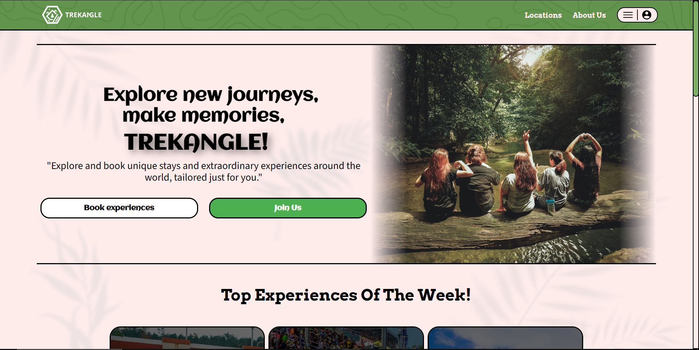
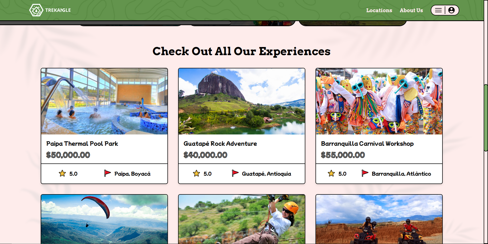
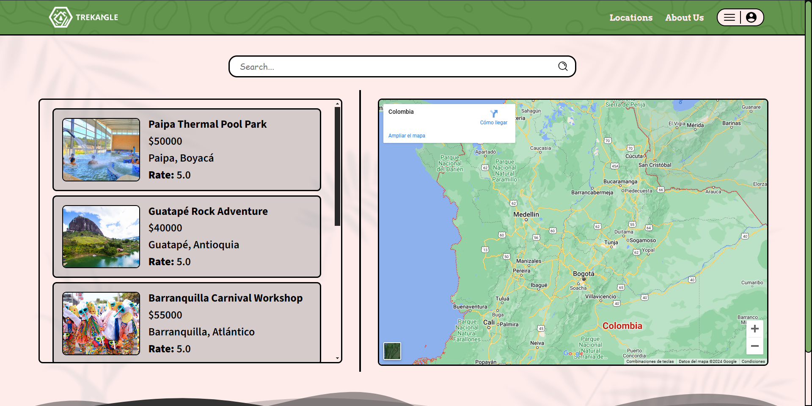
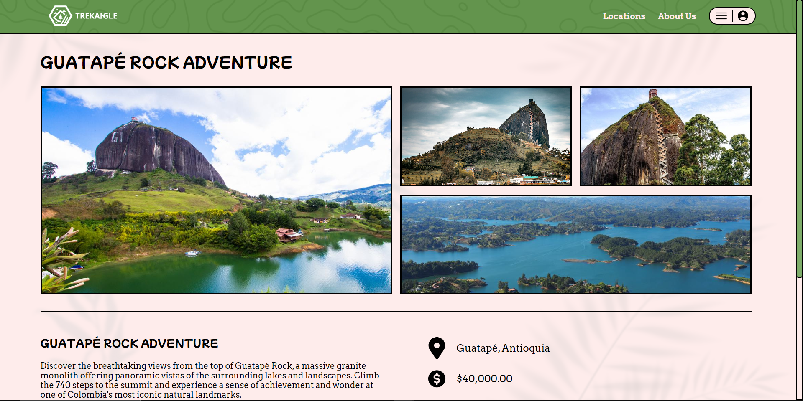

<p align="center">
  
</p>

# Trekangle Frontend
Este Frontend de Trekangle hace parte de el Proyecto Final de el programa de Desarrollo Web en BIT, en donde se desarrolla la vista del cliente de el E-commerce web de Trekangle.

## Características del Frontend

- Vista de la página de inicio del cliente.
- Vista de todas las experiencias de la aplicación.
- Vista de la página de registro de para registrarse en el sistema.
- Vista de la página de login de para ingresar a las características del cliente.
- Vista de la página de perfil del cliente.
- Funcion de añadir experiencias al carrito.
- Funcion de Reservar experiencias.

## 📸 Screenshots

<p align="center">
  
  
</p>
<p align="center">
  
  
</p>

## ⚙ Configuración local
```bash
# 1. Clonar el repositorio
git clone https://github.com/JuanesPachon/web-trekangle-client.git

# 2. Acceder a la carpeta principal del proyecto
cd web-trekangle-client

# 3. Instalar las dependencias utilizadas en el proyecto
npm install

# 4. Ejecutar La aplicación
ng serve --open

```


## 🧱 Estructura del Proyecto

- `/components`: Componentes Individuales de la aplicación.
- `/domains`: Páginas de la aplicación.
- `/services`: Servicios de la aplicación para la comunicación con la API.
- `/guards`: Guards de la aplicación para la autenticación y autorización.
- `/models`: Modelos de las entidades de la aplicación.
- `/assets`: Archivos estaticos de la aplicación.
  
## 🛠 Tecnologías Utilizadas

- **Angular**: Framework de desarrollo web.
- **TypeScript**: Lenguaje de programación.
- **RxJS**: Libreria de programación reactiva.
- **sweetalert2**: Libreria de alertas.
- **Google Maps API**: Libreria de mapas.